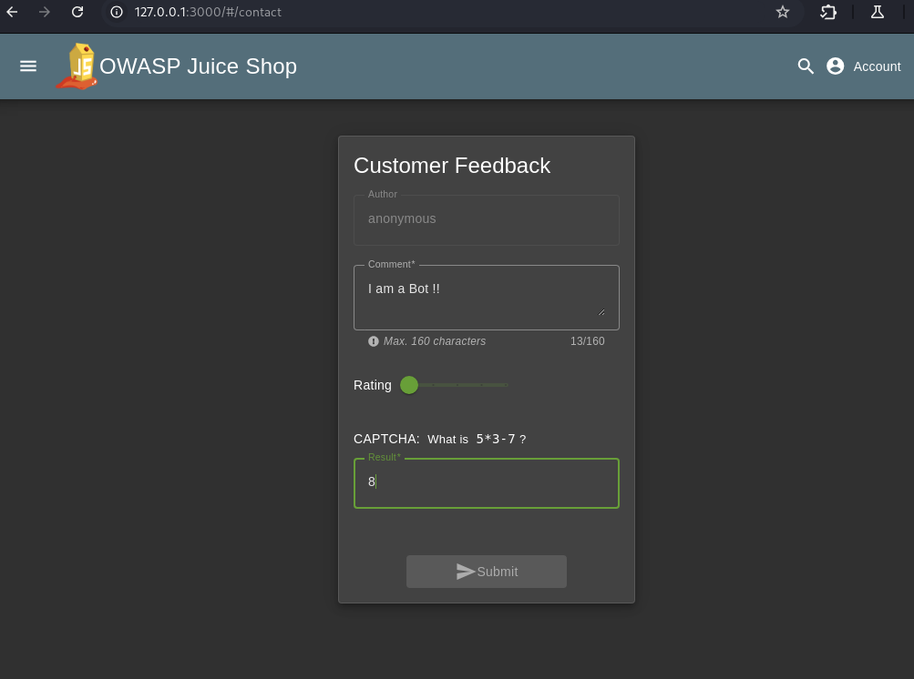
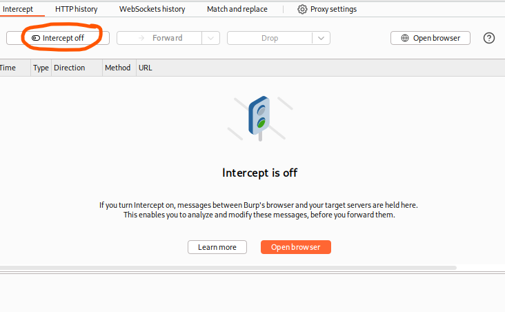
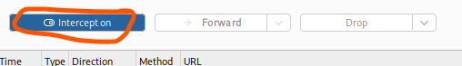
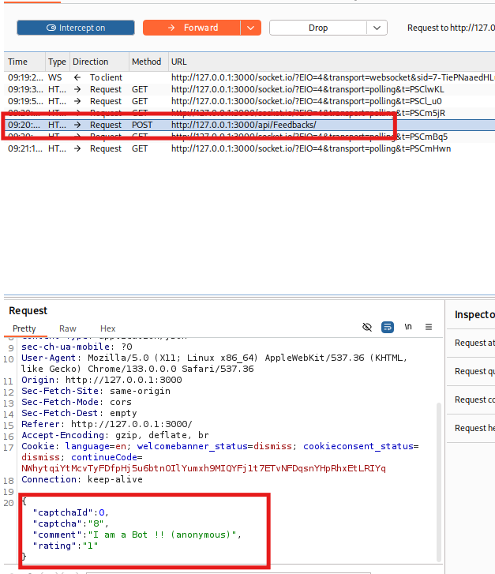
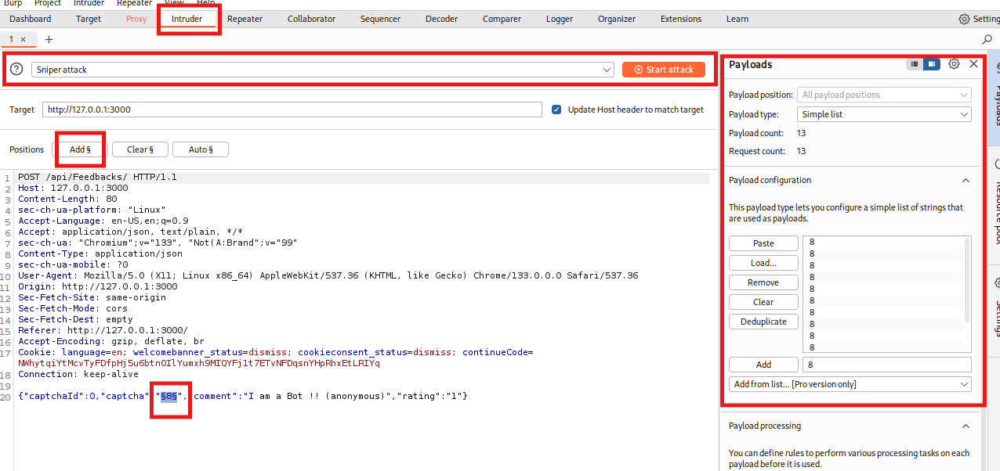
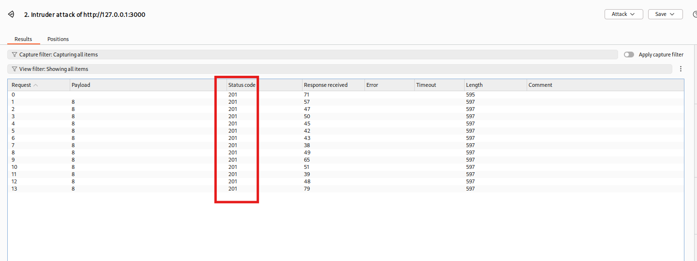

# CAPTCHA Bypass Challenge

## **Link to Video (German):**  
[Watch the video to this challenge](https://go.screenpal.com/watch/cT1eD1n6NQV)

## Table of Contents

1. [Challenge Overview](#challenge-overview)  
2. [What do you need to solve the challenge?](#what-do-you-need-to-solve-the-challenge)  
3. [Solution](#solution)  
   * [Step 1: Submit Feedback](#step-1-submit-feedback)  
   * [Step 2: Capture the Request](#step-2-capture-the-request)  
   * [Step 3: Analyze the Request](#step-3-analyze-the-request)  
   * [Step 4: Automate with Burp Intruder](#step-4-automate-with-burp-intruder)  
   * [Step 5: Confirm the Bypass](#step-5-confirm-the-bypass)  
4. [Summary](#summary)  
5. [Risks and Security Recommendations](#risks-and-security-recommendations)
6. [Recommendations for Developers](#recommendations-for-developers)

---

## Challenge Overview

#### Difficulty

* 3-Star-Challenge

#### Category

* Broken Anti-Automation

#### Description

* Submit 10 or more customer feedback messages within 20 seconds. This simulates bypassing a CAPTCHA that should prevent automated form submissions.

#### Hints from OWASP Juice Shop

* Once you find a CAPTCHA bypass, try to automate the feedback submission – either through scripting or just by using many tabs.

#### Hints from Developer Akademie

* Use **Burp Suite Intruder** or write a small **Python script** to automate the feedback form.

---

## What do you need to solve the challenge?

* **OWASP Juice Shop** running locally  
* Access to the **Contact Form**:
  ```bash
  http://127.0.0.1:3000/#/contact
  ```
* **Burp Suite**  
  * Proxy  
  * Intruder  
* Optional: A Python script  
* A bit of speed, or automation 😉

>[!NOTE]
> This challenge is a classic example of *Broken Anti-Automation*, where a CAPTCHA exists, but is not properly enforced.

---

## Solution

### Step 1: Submit Feedback

* First, we submit a test feedback manually to see how the process works.  
* Just go to the **Contact Us** page, enter a dummy message, and submit it.  
* Make sure Burp Suite is running and intercepting.



---

### Step 2: Capture the Request

* Switch to Burp Suite and turn **Intercept ON**.  
* Then submit the feedback again.  
* Burp should capture the request, including the CAPTCHA-related fields.

  


---

### Step 3: Analyze the Request

* Now look closely at the POST request to `/api/Feedbacks/`.  
* The CAPTCHA looks something like this:

```json
{
  "captchaId": 0,
  "captcha": "8",
  ...
}
```
> [!IMPORTANT]
> That means the CAPTCHA is not validated on the server-side — a serious flaw.



---

### Step 4: Automate with Burp Intruder

* Send the intercepted request to **Intruder**.  
* Choose a field like `captcha` or `comment` as the **payload position**.  
* Configure the payloads — either static or repetitive (e.g., send the same comment 10 times).  
* Start a **Sniper Attack**.



---

### Step 5: Confirm the Bypass

* If everything worked, each request will return HTTP **201 Created**.  
* You’ll also see the **confetti** and a success message in Juice Shop.



> [!NOTE]  
> And that’s it — CAPTCHA successfully bypassed! 🎉

---

## Summary

In this challenge, the CAPTCHA was implemented only on the **client-side**, making it useless against automated submissions.  
An attacker can simply intercept a valid request, manipulate it, and resend it multiple times — either manually, with a Python script, or by using tools like **Burp Intruder**.  
This kind of vulnerability is called **Broken Anti-Automation** and is particularly dangerous because it allows bots to abuse forms, brute-force credentials, or even perform denial-of-service attacks.

> [!IMPORTANT] 
> Just because a CAPTCHA is *visible* doesn't mean it's *effective*. It must always be enforced server-side.

---

## Risks and Security Recommendations

### Key Risks

1. **Spam and Form Abuse**  
   * Automated bots can flood the system with junk messages.
2. **Brute-Force Attacks**  
   * CAPTCHA bypass can lead to mass login attempts.
3. **Denial of Service (DoS)**  
   * Mass feedback submissions may overload the server.
4. **Data Pollution**  
   * Fake entries reduce the value of analytics and user feedback.
5. **Loss of Trust**  
   * Users may lose confidence in the application’s security.

---

### Recommendations for Developers

- **Server-side CAPTCHA Validation**  
  * Never trust client-side validation alone.
- **Rate Limiting**  
  * Block or slow down repetitive requests.
- **CAPTCHA Token Randomization**  
  * Avoid static or guessable CAPTCHA IDs.
- **Use Reputable CAPTCHA Providers**  
  * Like Google’s reCAPTCHA or hCaptcha.
- **Monitoring & Alerting**  
  * Watch for unusual behavior like rapid submissions from the same IP.

---

### Pro Tip

> [!IMPORTANT] 
> Even the best CAPTCHA is useless if it’s not checked by the backend. Don’t just put it on the form — enforce it!
