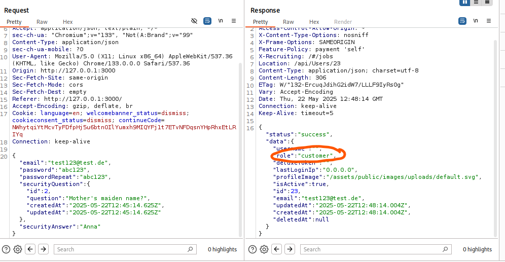
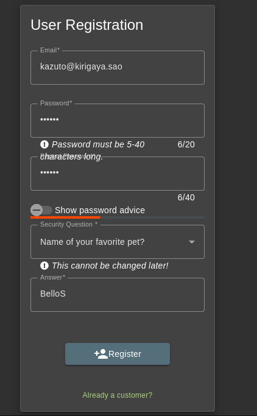
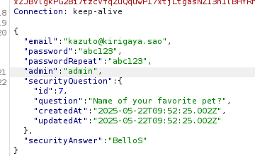
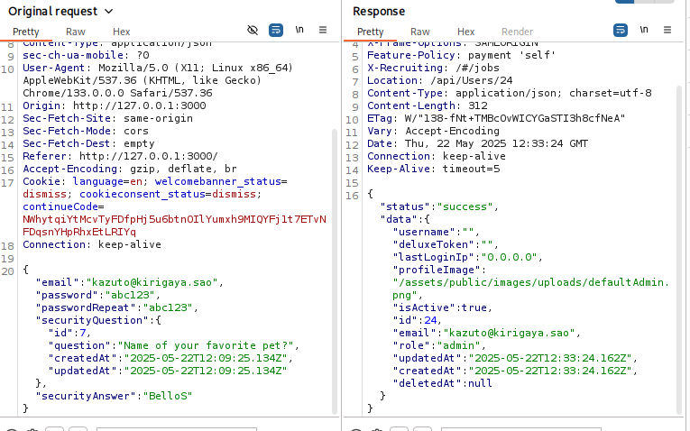
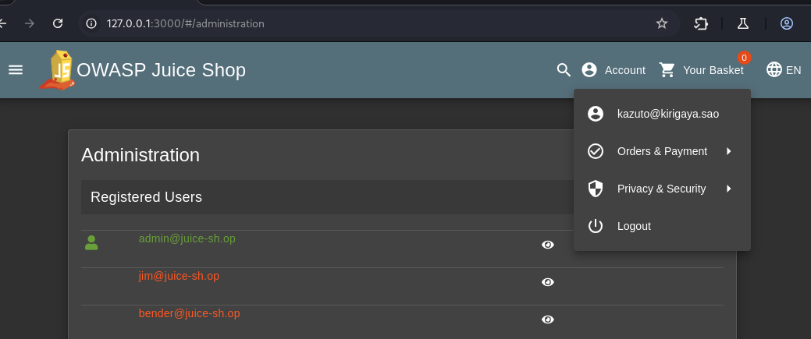

# Admin Registration

## **Link to Video (german):**

[Watch the video to this challenge](https://go.screenpal.com/watch/cT1eoTn6NVf)
   
## Table of Contents

1. [Challenge Overview](#challenge-overview)
2. [What do you need to solve the challenge?](#what-do-you-need-to-solve-the-challenge) 
3. [Solution](#solution)
   * [Register a dummy user and have a look at the HTTP response](#step-1-register-a-dummy-user-and-have-a-look-at-the-http-response)
   * [Examine the HTTP response](#step-2-examine-the-http-response)
   * [Specify the parameter role when registering](#step-3-specify-the-parameter-role-when-registering)
   * [Check the success](#step-4-check-the-success)
4. [Summary](#summary)
5. [Risks and Security Implications](#risks-and-security-implications)

## Challenge Overview

#### Difficulty

* 3-Star-Challenge

#### Category

* Improper Input Validation

#### Description

* Register as a user with administrator privileges.

#### Hints from OWASP Juice Shop itself

* You have to assign the unassignable.

#### Hints from the Developer Akademie

* For this challenge, create a new account in the OWASP Juice Shop. To do this, use the email address `kazuto@kirigaya.sao`. This account should have the same permissions as the admin account `admin@juice-sh.op`.
* The following questions will help you solve the challenge:
  * How do you determine whether you are an `admin` or a `customer` when you register?
  * How does the response you receive after registration help answer the first question?

## What do you need to solve the challenge?

* **OWASP Juice Shop**
  * registration page `http://127.0.0.1:3000/#/register`
* **Burp Suite** - [Click here for more information](https://portswigger.net/burp)
  * Proxy Server
  * HTTP history
  * Intercept mode

## Solution

### Step 1: Register a dummy user and have a look at the HTTP response

* If you want to use the HTTP response to find out how a newly registered user is classified as `admin` or `customer`, it is best to register a dummy user and look at the response using Burpsuit.
  * Open a terminal, start **Burpsuite**, navigate to the **Proxy** section and open the **Proxy Browser**.
  * Open in this browser the **Owasp Juice Shop** and navigate to the **registration page**: 
    * `Login > Not yet a customer? > User Registration` or
      * `http://127.0.0.1:3000/#/register`
    * Fill out the form with dummy data and click the *Register button* to register the dummy user.

### Step 2: Examine the HTTP response

* Switch to the Burpsuite window and have a look in the **HTTP history** tab.
* <ins>What do you see?</ins>
  * On the left side there is the registration POST request with the dummy data. 
  * On the right side there is shown the response. The dummy data was expanded, among other things, with the parameter: `"role": "customer"`.

      

* <ins>What does that mean?</ins>
  * The parameter `role` defines the user status.
  * There must be a way to specify it when registering.

### Step 3: Specify the parameter `role` when registering

* Fill out the register form with the given data and then **STOP!!!**

      

* Before clicking the *Register Button*, switch on the **Intercept mode** in the Burpsuite window to intercept the data that the form will send.
* Find the payload and add the parameter `"role": "admin"`:

    

* Forward the request until it is done.
* Change to the **HTTP history** tab and have a look at the response:
  * The parameter was successfully added to the user account. The user kazuto has the status `admin`.

    

* The OWASP Juice Shop gives the following feedback with confetti:
  * `You successfully solved a challenge: Admin Registration (Register as a user with administrator privileges.)`

### Step 4: Check the success

* Login with the user data of user `kazuto` and browse to `http://127.0.0.1:3000/#/administration`.
  * Only users with admin status have access to this page.

    

## Summary

In this challenge there is given a scenario of **Improper Input Validation** leading to a so-called **Privilege Escalation**.  
The user's entries in the registration form are not checked before they are further processed. Using Burpsuite, it was possible to intercept the HTTP request and manipulate it - adding the key-value pair `"role":"admin"` to the payload - so that the user gets administrative privileges. Actually, this parameter is not entered via the input mask. By default, each user is set a `"custumer"` status.  
  
**Developers bear the primary responsibility** for preventing and fixing such vulnerabilities - Ensuring roles and permissions are controlled server-side and implementing input validation and security reviews. **Users have limited options** - They only can report the vulnerability if they find one and avoid insecure platforms.

## Risks and Security Implications

The vulnerability shown in this challenge exposes the application to several serious risks:

### 1. Unauthorized Access to Sensitive Data

Attackers who gain administrative rights can access sensitive customer data, internal application settings, and analytics, which are typically protected.

### 2. Data Manipulation or Deletion

With admin privileges, malicious users could modify or delete user accounts, products, orders, or other critical data.

### 3. System Compromise

Administrators often have access to application configurations. An attacker could escalate further, exploit additional vulnerabilities, or introduce malicious code.

### 4. Compliance Violations

Improper access control mechanisms may result in violations of data protection regulations such as **GDPR** or **DSGVO**, possibly leading to legal consequences or fines.

### 5. Loss of Trust and Reputation

Security breaches can significantly harm the organization's credibility and user trust, especially if data leaks occur.

---

### Recommendations for Developers

* Enforce strict **server-side input validation**. Do not rely on client-side restrictions.
* Prevent role or permission fields from being set via user-controlled input.
* Implement **authorization checks** on all critical endpoints.
* Regularly perform **security reviews**, code audits, and penetration testing.